- Simple and easy
  - View
  - Text
  - Stylesheet => objects
    - FlexBox
      - Flex : 1 => vertically sari available space le le bhai
      - justifyContent: main axis aliggnment => vertical me bhai
      - alignItem => another axis ek around alignment
      - flexDirection => by default top to bottom hai
    - Positions
      - margin => sibilings ke bich ka space
      - padding => view ke andar ka space
- SafeAreaView

  - Start rendering inside the safe part of the screen
  - Almost every screen starts with SafeAreaView

- Concpets

  - TextInput
  - Pressable
    => thinking in terms of press => similer to Onclick , isme alag se lagana padta hai
  - StatusBar => 📶 4G 🔋 87% => this belongs to Android/IOS not my app
  - Mobile keyboard behavior
  - Controlled components using useState

- UI so far
  

Concepts

- ScrollView => for scrolling
  - by default => vertial scrolling
  - horizontal scrolling
- map() for rendering UI => Why map here ?
- Reusable CategoryChip component
- First-principles difference:
  ScrollView - Small static list - loads everything at the same time
  FlatList - Large dynamic lists - only create relevent ones , and crrearte on the go when we go in there - This process is called Virtualization

Concepts

- Image component
- Local assets (src/assets/images)
- Remote vs Local images
- resizeMode
- Dimensions API
- Responsive UI
- ScrollView with pagingEnabled (our first carousel)

Concepts

- FlatList (deep dive from first principles)
  - FlatList only renders what's visible + a small buffer.
  - Process is called Virtualization
  ```jsx
      <FlatList
          data={restaurants} // => about the data array  => [{}, {}, {}, {}]
          renderItem={...} // => For every restaurant object, create this UI
          keyExtractor={...} // => unique identifier
          showsVerticalScrollIndicator={false} // are vo scrollbar wala hai ye kuch
      />
  ```
- ImageBackground
  - why not imaages => becauee badges ye texts image ke upar aayega
  - in here => image becomes the container
- position: "absolute"
- overflow: "hidden"
- Reusable RestaurantCard
- Static restaurant data architecture

- UI so far
  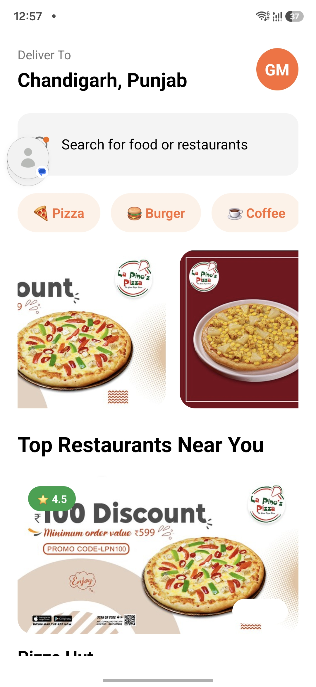

Concepts

- What is React Navigation?
  => change in the screen on tap
  => it is just a stack
  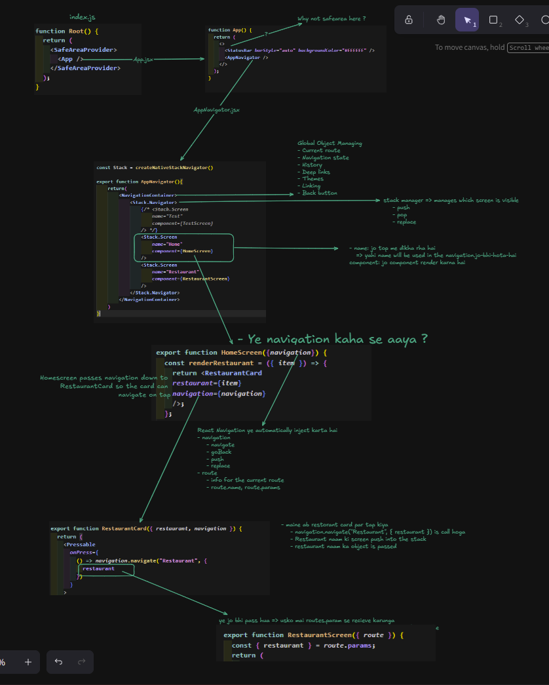
  NOTE: - jab mai home par hu, Stack: ["Home"] - Home se mai Restaurant par gaya, Stack: ["Home", "Restaurant"] - Restaurant is not the first screen, the stack navigator automatically shows: - A header bar (default: headerShown: true) - A back arrow on the left - The title "Restaurant" (from the screen name)
  

Concepts

- state Driven UI => UI is a function of state => change the state to change something in the UI
- conditional rendering
- local state
  - Lives inside one component
  - cannot be accessed by other screens
- react re-render - Component function runs again - react compares old UI with new UI - only changed native view updates in the screen
  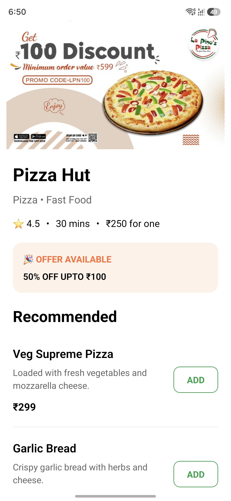
  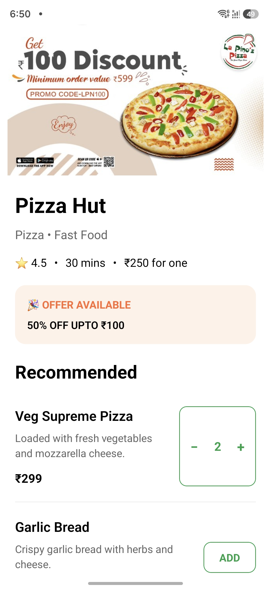

Concpets

- prop drilling

  - parent sends props, child receive props => child cannot directly use parent data
  - Now Auth aaya => everyone needs user data => every child needs user data
  - Passing props through components that I don't even use them
  - Data travels through unnecessary middle components

- context API arrives

  - insted of passing data through each componet, create a global state
  - New Thought process
    - Provider stores data
    - consumers reads data
  - Context Solves Exactly One Problem=> Avoid props drilling
  - Just provide shared values
  - Examples - Authentication - theme
    -Problem: - Unnecessary Re-renders - Everything lives inside one provider => app increases - theme , user, cart , orders, location, wishlist, location, notification - Now only card bagge changes => Every consumer can re-render when the provider value changes - Scaling Context Becomes Difficult - `jsx
        <AuthProvider>
            <ThemeProvider>
                <CartProvider>
                <LocationProvider>
                    <NotificationProvider>
                    <App/>
                    </NotificationProvider>
                </LocationProvider>
                </CartProvider>
            </ThemeProvider>
        </AuthProvider>
      ` - This is called Provider Hell => still managable but application becomes even larger

- Why Redux Was Introduced

  - Conetxt API existes , large application struggles with debuging, multiple teams working togethere
  - Redux came to solve application state managenment
  - Note karne wali baat ye hai ki, context API for shares values , and redux manages appliation state4
  - Redux
    - Bahut satr provider ki jagah par ek centralisaed store banao => store
      - Everything reads from one store.
      - Everything writes to one store.
  - Problem
    - became very verbose => to chaneg one value , need to change
      - action.js
      - reducer.js
      - constant.js
      - store.js
    - Developer wants something simpler

- zustand was interoduced
- Evolution
  - useState => one compoent
  - props => parent sends it to children
  - context API => let access to shared values without prop drilling
  - redux => centralied store => where state chanegs happend through
    - action
    - reducer
  - zustand => llightweight gloabal store

Vocab

- context => shared data container
- provider => supply shared data
- consumer => reads shaered data
- useContext() => hook to access context
  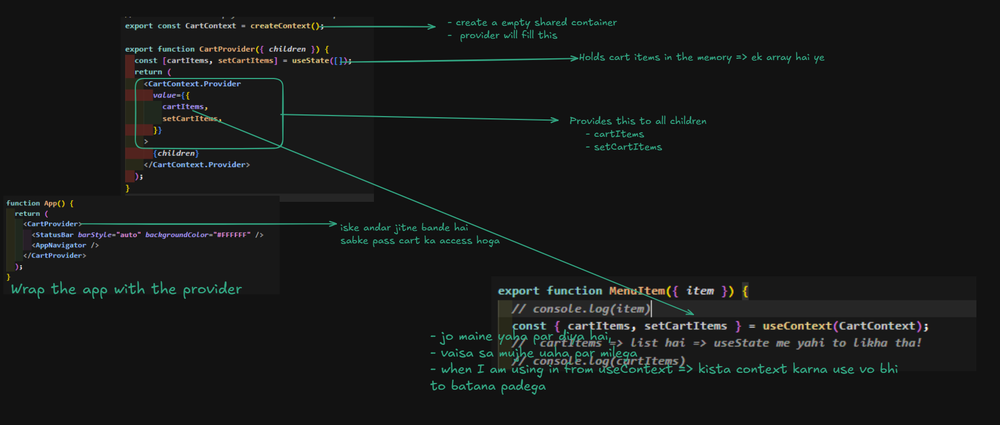

Concepts

- Derived State
  - compute from exisiting state
  - prevenrt duplicate source of truth
- reduce()
  - create your own
- Floating Components
  - Place outside ScrollView
  - Use position:absolute
  - keep component fixed on screen
  - CSS Positioning: https://medium.com/@gauravkmaurya09/css-positioning-explained-7279b1429f05
  - CSS FlexBox: https://medium.com/@gauravkmaurya09/mastering-flexbox-in-css-dba7f48b4373
- 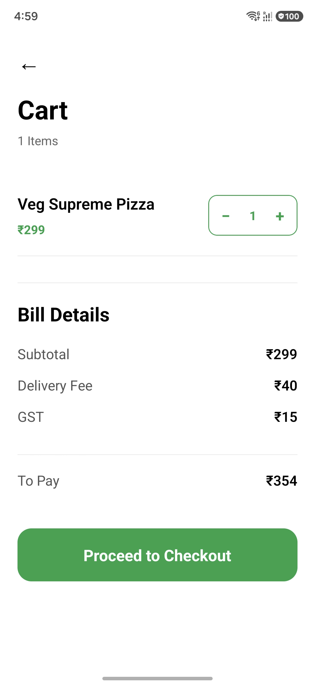

Concepts

- What is side effect
  - A react compoent should mainly do one thing
    - take state => reture me the UI
    - everything else is a side effect
    - 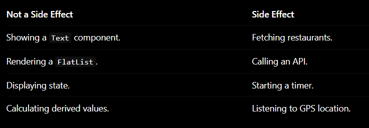
- Componet Lifecycle
  - Component created
  - Mounted => pahli baar appear component
  - Updated(many times) => seach kiya => Homescreen change hui
  - Unmounted => Homescreen se cart screen par gaya => homescreen unmount hua
- useEffect

  ```jsx
  useEffect(
    () => {
      // callback => code that perform side effect
    },
    [
      //when should this effect funciton run
    ],
  );
  ```

- dependency array []
  - enpty => Runs on mount => perfect for API calls
  - no dependency array => runs after every render
  - [search] => Runs whenever searchText changes
- Some effects need cleanup.
  ```jsx
  useEffect(() => {
    const timer = setInterval(() => {
      console.log('Tick');
    }, 1000);
    return () => {
      clearInterval(timer); // runs after unmount
    };
  }, []);
  ```
  - 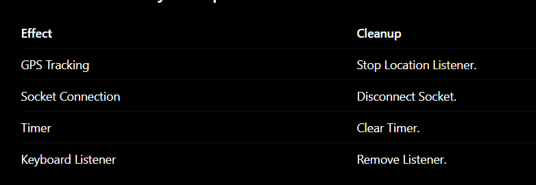

Concepts

- Controlled Components
  - controlled Input
    - textinput jaski value comes from react state

```jsx
const [searchText, setSearchText] = useState('');

<TextInput value={searchText} onChangeText={setSearchText} />;
// React always knows the current value.
```

- 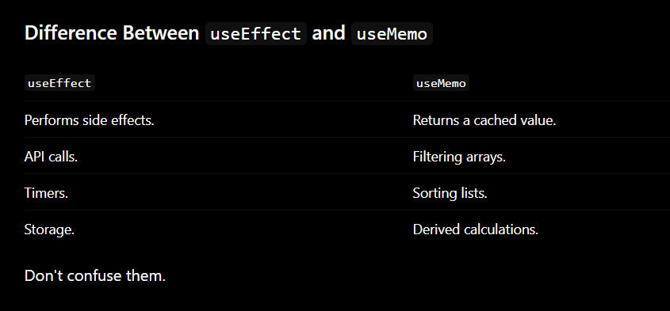

- Debouncing

  - Native Search
    - every key triggers api request
      - P => API request
      - I => API request
      - Z => API request
      - 3 network call => imageing 1 million users => huge waste
  - Debounced Search
    - P
    - I
    - Z
    - Z
    - wait 300ms
    - one API request
  - simple

    - user keeps typing => timer keeps resetting
    - user stops typing => API call Happens
    - this is debouncing

    ```
    0ms      P      Start Timer

    120ms    Pi     Reset Timer

    230ms    Piz    Reset Timer

    340ms    Pizz   Reset Timer

    470ms    Pizza  Reset Timer

    770ms           Timer Completes

                    API Request
    ```

- 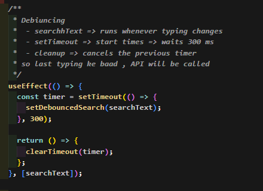

- Custom Hooks

  - reusable logic
  - componets =>> reusable UI and hooks => reusabel logic
  - 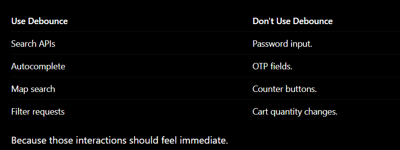

- Throttling

  - Native Search
    - every key triggers api request
      - P => API request
      - I => API request
      - Z => API request
      - 3 network call => imagining 1 million users => huge waste
  - Throttled Search
    - P => one API request immediately (System gets locked for 300ms)
    - I => Ignored (Locked)
    - Z => Ignored (Locked)
    - Z => Ignored (Locked)
    - 300ms passes => System unlocks
    - A => Next API request allowed
  - simple

    - user keeps typing => timer ignores updates during the interval
    - interval completes => system opens up for the next call
    - this is throttling

    ```
    0ms      P      API Request (Locks system for 300ms)

    120ms    Pi     Ignored (System is locked)

    230ms    Piz    Ignored (System is locked)

    300ms           System Unlocks

    340ms    Pizz   API Request (Locks system for 300ms again)

    470ms    Pizza  Ignored (System is locked)

    600ms           System Unlocks
    ```

```jsx
import { useState, useEffect, useRef } from 'react';

export function useThrottle(value, interval = 300) {
  const [throttledValue, setThrottledValue] = useState(value);
  const isThrottling = useRef(false);

  useEffect(() => {
    // If locked, ignore any incoming value changes
    if (isThrottling.current) return;

    // 1. Update value immediately (Leading edge)
    setThrottledValue(value);

    // 2. Lock the system
    isThrottling.current = true;

    // 3. Start timer to release the lock later
    const timer = setTimeout(() => {
      isThrottling.current = false;
    }, interval);

    // Cleanup when component unmounts
    return () => {
      clearTimeout(timer);
    };
  }, [value, interval]);

  return throttledValue;
}
```

- Core Difference in 1 Sentence
  - While Debouncing delays the API call until you stop typing, Throttling forces the API call to happen at a regular pace while you are typing


# Async Storage 
- Abhi tk => App works , but agar maine close kiya, it will not work at all 
- everything resets 
- Why ? 
  - because all our state lives in memory (RAM).
  - RAM is temporary 
  - Abhi tk kya ho rha tha ? 
    - App open => RAM loads => cart exists 
    - APP close => RAM cleared => cart gone

- So we introduce **persistent storage**
  - ab ye kya hai ? 
    - react native version of local storage 
    - Apne ko kya cahiye ? 
      - App open => disk storage => cart saved
      - App close => storage still exists 
      - App open again => cart restored
- 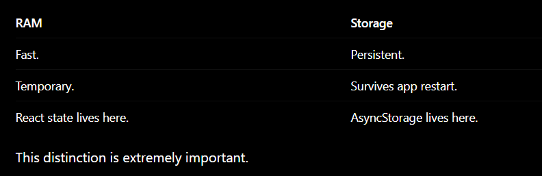

- AsyncStorage
  - key-value pair
  - web me local storage , yaha par AsuncStorage (alomst identiccal concpets)
  - What to store here 
    - JWT token
    - Cart items 
    - useer theme 
    - Delovery Address
  - What not to store 
    - Large images
    - Videos 
    - password in plain text

  - setItem(key, value) 
    - stores data => data strinng me hona cahiye 
    - **JSON.stringify(value)**

  - getItem(key)
    - return string => string store karta hai, to vahi return bhi karega na 
    - need to convert back => ***JSON.parse(value)**

  - Now expose there 2 function 
    - saveData, getData
    - Apne provider me ab 2 use effect banane hai 
      - Restore cart => only on mount 
      - Save cart => whenever cart changes 
```jsx
useEffect(() => {
  // Restore
}, []);

useEffect(() => {
  // Save
}, [cartItems]);
```