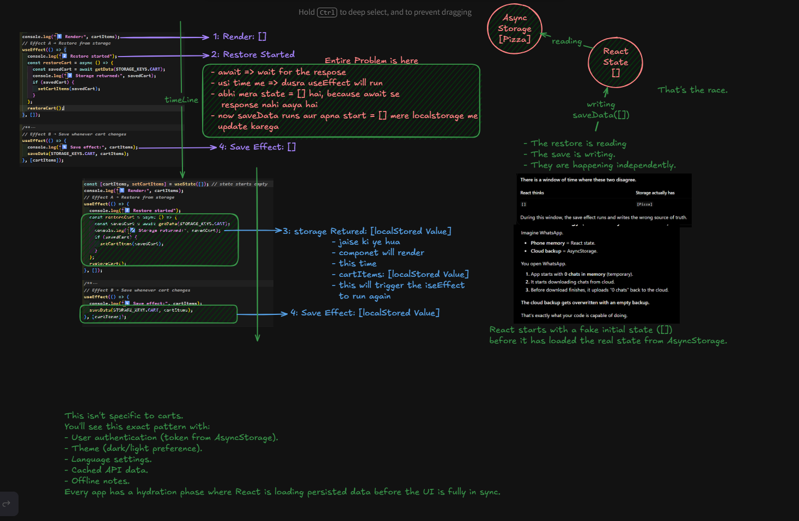
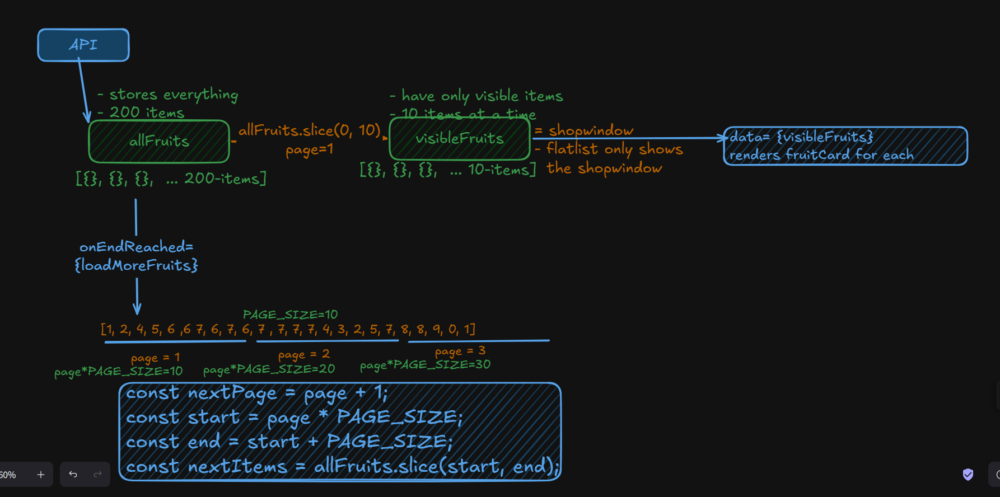
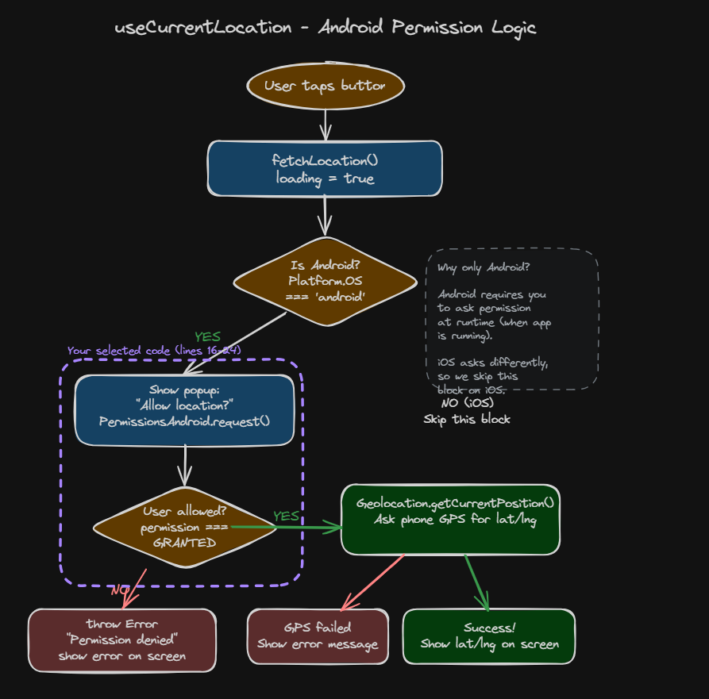
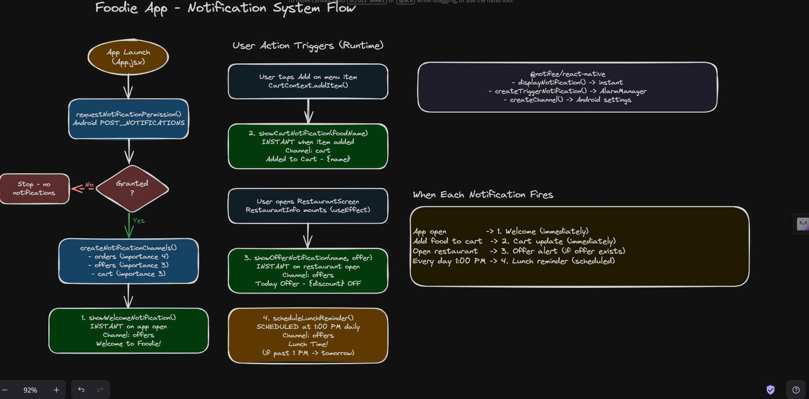
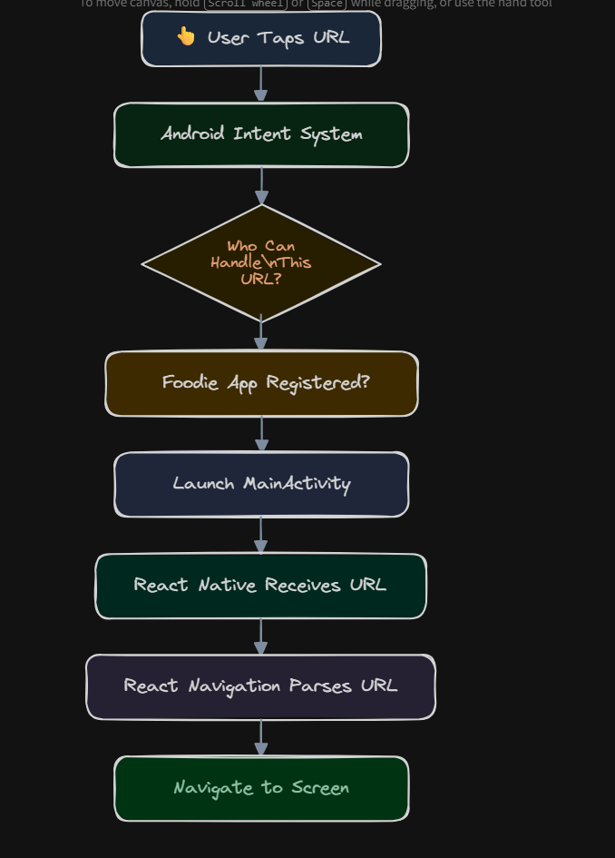

<div align="center">

# 🍕 Foodie — React Native Learning Project

[](.)
[](.)
[](.)

</div>

> A personal React Native learning log documenting every concept learned while building the Foodie app — from basic UI primitives to deep linking, notifications, and GPS.

---

## 📚 Table of Contents

| # | Topic |
|---|-------|
| 1 | [🧱 Core UI Primitives](#1--core-ui-primitives) |
| 2 | [📜 ScrollView, FlatList & Images](#2--scrollview-flatlist--images) |
| 3 | [🗺️ React Navigation](#3--react-navigation) |
| 4 | [⚙️ State-Driven UI](#4--state-driven-ui) |
| 5 | [🌐 Context API, Redux & Zustand](#5--context-api-redux--zustand) |
| 6 | [🔁 Derived State, useEffect & Side Effects](#6--derived-state-useeffect--side-effects) |
| 7 | [🔍 Controlled Components, Debouncing & Throttling](#7--controlled-components-debouncing--throttling) |
| 8 | [💾 AsyncStorage & Hydration](#8--asyncstorage--hydration) |
| 9 | [🎬 Lottie, FlashList & Pull-to-Refresh](#9--lottie-flashlist--pull-to-refresh) |
| 10 | [📄 Pagination & Animated API](#10--pagination--animated-api) |
| 11 | [📍 Location & GPS](#11--location--gps) |
| 12 | [🔔 Local Push Notifications](#12--local-push-notifications) |
| 13 | [🔗 Deep Linking](#13--deep-linking) |

---

## 1 · 🧱 Core UI Primitives

### Components

- **`View`** — the box/container primitive
- **`Text`** — for all text output
- **`StyleSheet`** — styles as JavaScript objects

### FlexBox

| Property | What it does |
|----------|-------------|
| `flex: 1` | Take all available vertical space |
| `justifyContent` | Align on the **main axis** (vertical by default) |
| `alignItems` | Align on the **cross axis** |
| `flexDirection` | Default: top-to-bottom (`column`) |

### Positions

| Property | What it does |
|----------|-------------|
| `margin` | Space **between siblings** |
| `padding` | Space **inside** the view |

### SafeAreaView

- Starts rendering inside the **safe part of the screen** (avoids notches, status bar)
- **Almost every screen** starts with `SafeAreaView`

### Other Concepts

| Concept | Notes |
|---------|-------|
| `TextInput` | Controlled input component |
| `Pressable` | Think in terms of **press** — like `onClick`, but you wire it up manually |
| `StatusBar` | 📶 4G 🔋 87% — belongs to Android/iOS, not your app |
| Mobile keyboard behavior | How keyboard pushes content up |
| Controlled components | Drive input value from `useState` |

### UI Snapshot


---

## 2 · 📜 ScrollView, FlatList & Images

### ScrollView

- Default: **vertical** scrolling
- Also supports **horizontal** scrolling
- Loads **everything at once** — best for small, static lists

### Rendering Lists

- Use `map()` to render UI from data arrays
- Build **reusable components** (e.g. `CategoryChip`)

### ScrollView vs FlatList

| | ScrollView | FlatList |
|-|------------|----------|
| Best for | Small static lists | Large dynamic lists |
| Rendering | Loads everything at once | **Virtualization** — renders only visible items + small buffer |
| Performance | Fine for ~20 items | Essential for 100+ items |

### Image Component

| Concept | Notes |
|---------|-------|
| Local assets | `src/assets/images` |
| Remote vs Local | `source={{ uri: '...' }}` vs `require('./img.png')` |
| `resizeMode` | `cover`, `contain`, `stretch`, `center` |
| `Dimensions` API | Get screen width/height for responsive UI |
| `ScrollView` + `pagingEnabled` | Our **first carousel** 🎠 |

### FlatList Deep Dive

- Only renders **visible items + a small buffer** (Virtualization)

```jsx
<FlatList
    data={restaurants}         // the data array [{}, {}, {}, {}]
    renderItem={...}           // for every item, create this UI
    keyExtractor={...}         // unique identifier per item
    showsVerticalScrollIndicator={false}
/>
```

### ImageBackground

- Use **`ImageBackground`** instead of `Image` when you need text/badges **on top** of an image
- The image **becomes the container**

### Positioning

| Property | Effect |
|----------|--------|
| `position: "absolute"` | Lifts element out of normal flow |
| `overflow: "hidden"` | Clips child content outside bounds |


---

## 3 · 🗺️ React Navigation

> Change screens on tap — it's just a **stack**.


**How the Stack works:**

| Action | Stack State |
|--------|------------|
| On Home | `["Home"]` |
| Navigate to Restaurant | `["Home", "Restaurant"]` |

- **Stack Navigator** automatically adds:
  - A header bar (`headerShown: true` by default)
  - A back arrow on the left
  - The screen name as the title


---

## 4 · ⚙️ State-Driven UI

> **UI is a function of state** — change the state, change the UI.

### Concepts

| Concept | Notes |
|---------|-------|
| Conditional rendering | Show/hide elements based on state |
| Local state | Lives inside one component — cannot be accessed by other screens |
| React re-render | Component function runs again → React diffs old/new UI → only changed native views update |


---

## 5 · 🌐 Context API, Redux & Zustand

### The Problem — Prop Drilling

- Parent sends props → child receives props → child's child also needs it
- When auth arrives → **everyone needs user data**
- Data travels through **unnecessary middle components** that don't even use it

### Context API

- Instead of passing data through each component → create a **global state**
- **Provider** stores data → **Consumers** read data
- **Solves exactly one problem:** avoid prop drilling

> ✅ Good for: Authentication, Theme

**Problem with Context at scale:**
- Unnecessary re-renders — everything inside one provider
- As app grows: theme, user, cart, orders, location, wishlist, notifications all in one place
- If only the cart badge changes → **every consumer can re-render**

```jsx
<AuthProvider>
    <ThemeProvider>
        <CartProvider>
        <LocationProvider>
            <NotificationProvider>
            <App/>
            </NotificationProvider>
        </LocationProvider>
        </CartProvider>
    </ThemeProvider>
</AuthProvider>
```
> This is called **Provider Hell** — still manageable but gets worse as app grows.

### Why Redux Was Introduced

- Context API exists, but large applications struggle with debugging and multiple teams
- Redux came to solve **application state management**
- Key distinction: Context API = shared values / Redux = manages application state

**Redux approach:** instead of many providers → **one centralized store**
- Everything reads from one store
- Everything writes to one store

**Redux problem:** became very verbose — to change one value you need:
- `action.js`
- `reducer.js`
- `constant.js`
- `store.js`

### Zustand

- Lightweight global store — simpler than Redux, more scalable than Context

### State Management Evolution

```
useState       →  one component
props          →  parent → children
Context API    →  shared values without prop drilling
Redux          →  centralized store (action + reducer pattern)
Zustand        →  lightweight global store
```

### Vocabulary

| Term | Meaning |
|------|---------|
| `context` | Shared data container |
| `provider` | Supplies shared data |
| `consumer` | Reads shared data |
| `useContext()` | Hook to access context |


---

## 6 · 🔁 Derived State, useEffect & Side Effects

### What Is a Side Effect?

> A React component should mainly do one thing: **take state → return UI**.
> Everything else is a **side effect**.


### Derived State

- **Compute from existing state** — don't duplicate it
- Prevents multiple sources of truth

### Component Lifecycle

| Phase | When |
|-------|------|
| **Created** | Component function first defined |
| **Mounted** | First time it appears on screen |
| **Updated** | State changes → component re-renders |
| **Unmounted** | Navigate away → component removed from tree |

### useEffect

```jsx
useEffect(
  () => {
    // callback → code that performs the side effect
  },
  [
    // dependency array → when should this effect run?
  ],
);
```

### Dependency Array

| Pattern | When it runs |
|---------|-------------|
| `[]` | **Mount only** — perfect for initial API calls |
| no array | After **every render** |
| `[searchText]` | Whenever `searchText` changes |

### Cleanup

```jsx
useEffect(() => {
  const timer = setInterval(() => {
    console.log('Tick');
  }, 1000);
  return () => {
    clearInterval(timer); // runs on unmount
  };
}, []);
```


### Floating Components

- Place **outside** ScrollView
- Use `position: absolute`
- Keeps the component **fixed on screen** regardless of scroll

📖 References:
- [CSS Positioning Explained](https://medium.com/@gauravkmaurya09/css-positioning-explained-7279b1429f05)
- [Mastering FlexBox in CSS](https://medium.com/@gauravkmaurya09/mastering-flexbox-in-css-dba7f48b4373)


---

## 7 · 🔍 Controlled Components, Debouncing & Throttling

### Controlled Components

> A **controlled input** is a TextInput whose value comes entirely from React state.

```jsx
const [searchText, setSearchText] = useState('');

<TextInput value={searchText} onChangeText={setSearchText} />;
// React always knows the current value.
```


### Debouncing

**The problem — Naive Search:**
- Every keystroke triggers an API request
- `P` → API | `i` → API | `z` → API | = huge waste at scale

**Debouncing:**
- User keeps typing → timer **keeps resetting**
- User **stops** typing → API call fires once

```
0ms      P      Start Timer
120ms    Pi     Reset Timer
230ms    Piz    Reset Timer
340ms    Pizz   Reset Timer
470ms    Pizza  Reset Timer
770ms           Timer Completes → API Request
```


### Custom Hooks

- **Components** → reusable UI
- **Hooks** → reusable logic


### Throttling

**Throttling:**
- First keystroke → **immediate API call**, system **locks for 300ms**
- Keystrokes during lock → **ignored**
- Lock expires → next keystroke allowed

```
0ms      P      API Request (Locks for 300ms)
120ms    Pi     Ignored (Locked)
230ms    Piz    Ignored (Locked)
300ms           System Unlocks
340ms    Pizz   API Request (Locks again)
470ms    Pizza  Ignored (Locked)
600ms           System Unlocks
```

```jsx
import { useState, useEffect, useRef } from 'react';

export function useThrottle(value, interval = 300) {
  const [throttledValue, setThrottledValue] = useState(value);
  const isThrottling = useRef(false);

  useEffect(() => {
    // If locked, ignore any incoming value changes
    if (isThrottling.current) return;

    // 1. Update value immediately (Leading edge)
    setThrottledValue(value);

    // 2. Lock the system
    isThrottling.current = true;

    // 3. Start timer to release the lock later
    const timer = setTimeout(() => {
      isThrottling.current = false;
    }, interval);

    // Cleanup when component unmounts
    return () => {
      clearTimeout(timer);
    };
  }, [value, interval]);

  return throttledValue;
}
```

### Debouncing vs Throttling — Core Difference

> **Debouncing** delays the API call until you **stop** typing.
> **Throttling** forces the API call to happen at a **regular pace** while you are typing.

---

## 8 · 💾 AsyncStorage & Hydration

### The Problem

> Until now: App works — but close it and **everything resets**.

**Why?** All state lives in memory (RAM). RAM is temporary.

```
App open   → RAM loads → cart exists
App close  → RAM cleared → cart gone
```

### Persistent Storage

> React Native's version of `localStorage`.

```
App open        → disk storage → cart saved
App close       → storage still exists
App open again  → cart restored
```


### AsyncStorage

- **Key-value pair** store (almost identical concept to web `localStorage`)

**What to store:**
- ✅ JWT token
- ✅ Cart items
- ✅ User theme
- ✅ Delivery address

**What NOT to store:**
- ❌ Large images
- ❌ Videos
- ❌ Passwords in plain text

**Core methods:**

| Method | Notes |
|--------|-------|
| `setItem(key, value)` | Value must be a string → use **`JSON.stringify(value)`** |
| `getItem(key)` | Returns string → convert back with **`JSON.parse(value)`** |

**Two `useEffect`s needed in your provider:**

```jsx
useEffect(() => {
  // Restore cart — runs only on mount
}, []);

useEffect(() => {
  // Save cart — runs whenever cart changes
}, [cartItems]);
```

### Hydration & Dehydration

| Term | Meaning |
|------|---------|
| **Hydration** | On app open — read saved data from disk and load it into React state |
| **Dehydration** | Saving data to disk before state is lost |



---

## 9 · 🎬 Lottie, FlashList & Pull-to-Refresh

### Lottie

**Why not GIF?**

| GIF | Lottie |
|-----|--------|
| 100s of images played in sequence | JSON file of animation instructions |
| Heavy file size | Tiny |
| Not scalable | Scales to any resolution |
| Poor quality on different screen sizes | Perfect quality everywhere |

> A Lottie file is a JSON document describing **shapes, colors, paths, timing, and movement** — just instructions, rendered frame by frame.

### FlashList

- Better performance than FlatList for long lists
- Improves: scroll smoothness + memory usage
- Uses **recycling** — reuses existing cells instead of creating new ones
- 📖 [How recycling works](https://shopify.github.io/flash-list/docs/recycling)

### Pull to Refresh

**What actually happens:**
1. User pulls down → spinner appears
2. Network request → loading indicator shown
3. Request finishes → spinner hides, UI updates

Three independent events:
- **Pull** → start refresh
- **Network request** → show loading indicator
- **Request finishes** → hide spinner and update UI

---

## 10 · 📄 Pagination & Animated API

### Why Pagination?

**Without pagination:**
- Server gives 20,000 items → phone downloads **everything**
- Problems: huge network usage, slow launch, high memory consumption

**With pagination:**
- Server loads first 10 → user scrolls → next 10 → user scrolls → next 10
- App downloads data **only when needed**

### Two Types of Pagination

**Server-side:**
```http
GET /restaurants?page=2&limit=10
```

**Client-side:**
```http
GET https://www.fruityvice.com/api/fruit/all
```
> Download all at once into `allFruits`, show 10 at a time in `visibleFruits`.
> FlashList renders the window. Scroll triggers slice math to append the next 10.



### Animated API — Skeleton Loading

**Traditional Spinner Problems:**
- User has no idea what's coming
- Layout suddenly appears after loading
- Feels slower
- Bad user experience

**Skeleton Loading:**
- User immediately understands what is arriving
- Fake UI that **mimics the final layout** before real data arrives

**How shimmer works:**
1. Gray placeholder card
2. Light strip moves left → right
3. Repeats forever

**Three pieces of Animated API:**

| Piece | Role |
|-------|------|
| `Animated.Value` | The animated number |
| Animation Driver | `Animated.loop()`, `Animated.timing()` — drives the value |
| Animated Component | `Animated.View` — the thing that actually moves |

---

## 11 · 📍 Location & GPS

### Why Location?

> Where should I deliver food?
> Everything depends on it:

- Nearest Restaurants
- Delivery Distance
- Delivery Charges
- Estimated Delivery Time

### Why Can't My App Read Location Directly?

- Android **protects user privacy**
- App cannot access camera, gallery, contacts, microphone, or location **without permission**
- App runs inside a **sandbox** — must ask the Android OS before accessing resources

### How GPS Works

```
Phone → communicates with multiple satellites

1 satellite  →  gives a circle (you could be anywhere on it)
2 satellites →  two circles → two possible intersection points
3 satellites →  three circles → ONE location (Trilateration)
```

GPS returns:

```json
{
  "latitude": 26.912401,
  "longitude": 75.787312,
  "accuracy": 8
}
```

> `accuracy: 8` means the location is accurate within **8 meters**.

### Android Permission Types

| Type | When |
|------|------|
| **Manifest Permission** | Declared at app installation time |
| **Runtime Permission** | Requested while app is running (popup) |

> Without the Manifest declaration, the Runtime popup **will never appear**.

### Android Permission Lifecycle

```
Install App
  → Manifest declares permission
    → User uses feature
      → Runtime Permission Popup
        → Grant  → proceed to GPS
        → Deny   → show error
        → Never ask again → open Settings
```

### How JS Accesses GPS — The Bridge

> JS cannot read GPS directly. React Native acts as a bridge.

```
JS code
  → @react-native-community/geolocation (native module)
    → Android Location API
      → GPS hardware
        → Coordinates returned
```

---

### Implementation Steps

#### Files Touched

| File | Why |
|------|-----|
| `package.json` | Install geolocation native module |
| `android/app/src/main/AndroidManifest.xml` | Declare location permission at install time |
| `src/hooks/useCurrentLocation.js` | Reusable permission + GPS logic (custom hook) |
| `src/screens/AddressScreen.js` | UI button that triggers location fetch |

#### Step 1 — Install the Package

```bash
npm install @react-native-community/geolocation
```

- React Native JS cannot talk to GPS hardware directly
- This package is the **bridge** between JS and Android Location API
- Without it, `Geolocation.getCurrentPosition()` does not exist

#### Step 2 — Manifest Permission

```xml
<uses-permission android:name="android.permission.ACCESS_FINE_LOCATION"/>
<uses-permission android:name="android.permission.ACCESS_COARSE_LOCATION"/>
```

| Permission | What it grants |
|------------|---------------|
| `ACCESS_FINE_LOCATION` | Precise GPS coordinates |
| `ACCESS_COARSE_LOCATION` | Approximate location (network/cell tower) |

#### Step 3 — Custom Hook

Why a custom hook?
- Permission + GPS logic belongs in a hook, **not in the screen**
- Reusable on any screen that needs location
- Screen stays clean — only calls `fetchLocation()`



**Part A — Ask permission (Android only):**

```jsx
if (Platform.OS === 'android') {
  const permission = await PermissionsAndroid.request(
    PermissionsAndroid.PERMISSIONS.ACCESS_FINE_LOCATION,
  );

  if (permission !== PermissionsAndroid.RESULTS.GRANTED) {
    throw new Error('Location permission denied');
  }
}
```

| Line | What it does |
|------|-------------|
| `Platform.OS === 'android'` | Block runs Android only |
| `PermissionsAndroid.request()` | Shows Allow / Deny popup |
| `ACCESS_FINE_LOCATION` | Requests precise GPS |
| If denied | Throws error → `catch` sets `error` state |

**Part B — Read GPS coordinates:**

```jsx
Geolocation.getCurrentPosition(
  position => {
    setLocation(position.coords);
    setLoading(false);
  },
  e => {
    setError(e.message);
    setLoading(false);
  },
);
```

**Hook returns:**

```jsx
return { location, loading, error, fetchLocation };
```

| Return | Meaning |
|--------|---------|
| `location` | Coords after success |
| `loading` | `true` while fetching |
| `error` | Message if permission denied or GPS failed |
| `fetchLocation` | Call this on button press |

#### Step 4 — UI in AddressScreen

```jsx
const { location, loading, error, fetchLocation } = useCurrentLocation();

<Pressable onPress={fetchLocation} disabled={loading}>
  {loading ? <ActivityIndicator /> : <Text>Use Current Location</Text>}
</Pressable>

{error ? <Text>{error}</Text> : null}

{location ? (
  <View>
    <Text>Latitude: {location.latitude}</Text>
    <Text>Longitude: {location.longitude}</Text>
  </View>
) : null}
```

> Ask permission **only when user needs it** — user tapped the button, so they expect the popup.

#### Full Permission Lifecycle

```
1. App installed        → Android reads Manifest permissions
2. User opens Cart      → no popup yet (we did not ask)
3. User taps button     → PermissionsAndroid.request() runs
4. User taps Allow      → Geolocation.getCurrentPosition() runs
5. GPS returns coords   → location state updates in hook
6. UI shows             → latitude, longitude, accuracy on AddressScreen
```

---

## 12 · 🔔 Local Push Notifications

### What Is a Notification?

- A message delivered by the **Operating System**
- Has three parts: **data**, **appearance**, and **behavior**
- **NOTE: Notifications belong to Android/iOS — not React Native**

### Why Can't React Native Show Notifications Directly?

- Notifications live **outside my app**
- Only Android/iOS can display notifications globally
- **My app sends the request → Android displays the notification**

### Two Types of Notifications

| | Local | Push |
|-|-------|------|
| Triggered by | App itself | Backend / server |
| Internet required | ❌ No | ✅ Yes (FCM/APNs) |
| Works offline | ✅ Yes | ❌ No |
| Use cases | Reminders, timers | Orders, messages, offers |
| Examples | Lunch reminder at 1 PM, daily cart reminder | Order out for delivery, new restaurant nearby |

### Android Notification Architecture

> Every notification passes through this pipeline:

```
React Native Application
        ↓
Notification Service (JS)
        ↓
Notifee Native Module
        ↓
Android Notification Manager
  │
  ├── Display notification
  ├── Group notifications
  ├── Handle sound/vibration
  ├── Show badges
  └── Handle notification priority
        ↓
Notification Channel
        ↓
Notification Drawer
```

### Notification Channels

- A **category** of notifications
- Each channel has its own sound, vibration, and priority
- Users can **mute only Offers** while keeping Orders enabled

| Channel | Examples |
|---------|---------|
| `orders` | Your order is confirmed, Order out for delivery |
| `offers` | Festival sale, Discount coupon |
| `reminders` | Lunch at 1 PM, Cart abandoned |
| `cart` | Item back in stock |

### Why Notifee?

- ✅ Local notifications
- ✅ Notification channels
- ✅ Scheduling
- ✅ Foreground / background events
- ✅ FCM integration (later)



### Notification Use Cases

| Type | Example |
|------|---------|
| Basic | "Welcome to Foodie" |
| Big Text | Festival offer with long description |
| Image | Pizza offer with banner image |
| Inbox / Multiple | "3 new restaurant offers" |
| Progress | "Preparing Order (0–100%)" |
| Ongoing | "Delivery in progress" |
| Scheduled | "Lunch reminder" |
| Grouped | Multiple offers grouped together |
| Action | Accept / Dismiss coupon |
| Data (FCM Ready) | Open restaurant / cart / offer screen |
| Actionable | Spotify-like media controls |

### Every Notification Has 3 Layers

| Layer | Properties |
|-------|-----------|
| **UI** | title, body, image, icon |
| **Behavior** | sound, vibration, priority, auto-cancel |
| **Data** | restaurantId, cartId, offerId, screen |

---

## 13 · 🔗 Deep Linking

> When you click a link → it opens a **specific screen** inside the app.
> A Deep Link is simply a **URL that points to a location inside my app**.

### Real-World Example

```
I get a link on WhatsApp: foodie://restaurant/42
I click it
Android detects the URL
Foodie app opens
Restaurant Details Screen opens
Restaurant ID = 42 shown
```

)

> **Business benefit:** Higher conversion rate.

### URL Anatomy

```
scheme://path/parameter?query=value
foodie://restaurant/42?coupon=FIRST50
```

| Part | Role | Example |
|------|------|---------|
| `scheme` | App identity | `foodie://` |
| `path` | Route / screen | `restaurant/` |
| `parameter` | Dynamic value | `42` |
| `query params` | Extra data | `?coupon=FIRST50` |

### Three Types of Deep Links

**Type 1 — Custom URL Scheme**
```
foodie://cart
foodie://restaurant/42
```
- ✅ No website needed
- ✅ Easy to configure
- ⚠️ Works only if app is installed

**Type 2 — Universal Links (iOS)**
```
https://foodie.com/cart
```
- If app installed → opens app
- Otherwise → opens website

**Type 3 — Android App Links**
```
https://foodie.com/restaurant/42
```
- Verified with Android
- Safer than custom schemes

### How Android Handles a Deep Link



### Android Intent

> Android communicates between apps using **Intents**.
> Deep links are **Intent Filters**.

Example: Camera intent → camera opens.

### React Native Linking API

| Method | When it's used |
|--------|---------------|
| `Linking.getInitialURL()` | App launched **from a closed state** |
| `Linking.addEventListener("url")` | App **already running** |

> - **App closed** → No JS exists yet → use `getInitialURL()`
> - **App running** → JS is alive → use event listener

### Deep Link Data Types

| Type | Example |
|------|---------|
| Path params | `foodie://restaurant/15` |
| Query params | `foodie://restaurant/15?coupon=SAVE10` |
| Fragment | `foodie://profile/orders#active` |

### Firebase + Deep Links

> Firebase does **not navigate** — it only **delivers data**.

| App State | Firebase Handler |
|-----------|-----------------|
| Foreground | `onMessage()` |
| Background | `onNotificationOpenedApp()` |
| Quit | `getInitialNotification()` |

### Industry Terms

| Term | Meaning |
|------|---------|
| **ROX** | Return on experience |
| **Conversion rate** | % of users who complete an action |
| **Retention rate** | % of users who return |
| **Cold start** | App is closed — starting fresh |
| **Warm start** | App already in memory — resumes quickly |
| **Background** | App is minimized but still in memory |

---

<div align="center">

*React Native Learning Project — Foodie App*

</div>