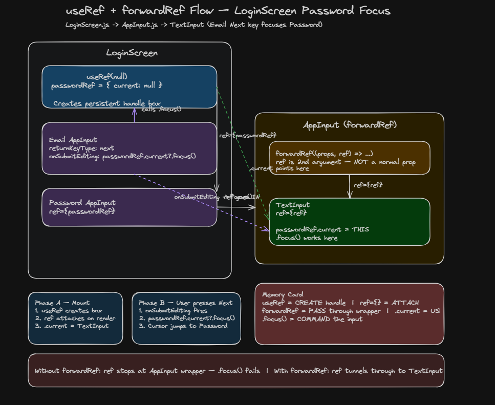

<div align="center">

# 📋 Module 12 — Summary
### React Native Foundation: Mobile Forms & Login UX

[](readme.md)
[](useRef-forwardRef-flow.excalidraw)
[](.)

</div>

---

> 📖 **This is the quick-reference summary.**
> For full concept breakdowns, diagrams, and deep dives → **[open readme.md](readme.md)**

---

## 📌 Flows to Remember

| Flow | Remember As | Read More |
|------|------------|-----------|
| 🔄 **Form lifecycle** | Type → onBlur validate → submit validate all → API | [→ readme.md](readme.md#mobile-form-lifecycle) |
| ⌨️ **Keyboard types** | Match keyboard to data — email-address, phone-pad, number-pad | [→ readme.md](readme.md#keyboard-selection) |
| 🔐 **Autofill** | `autoComplete` hints OS — app never stores saved emails | [→ readme.md](readme.md#autofill-architecture) |
| 📱 **OTP autofill** | OS reads SMS, not React Native — declare `sms-otp` | [→ readme.md](readme.md#otp-autofill-flow) |
| ✅ **Validation timing** | onChange = update state · onBlur = validate · submit = validate all | [→ readme.md](readme.md#validation-timing) |
| 🎯 **Focus chain** | `returnKeyType` + `useRef` + `forwardRef` + `onSubmitEditing` | [→ readme.md](readme.md#focus-management-useref-forwardref) |
| 📐 **Keyboard layout** | KeyboardAvoidingView + tap-to-dismiss + ScrollView | [→ readme.md](readme.md#keyboard-avoiding-layout) |
| 🍔 **Foodie login** | useLoginForm → LoginScreen → AppInput → TextInput | [→ readme.md](readme.md#foodie-login-implementation) |

---

## ⚡ Short Notes

| Term | Short Note |
|------|-----------|
| **onBlur validation** | Validate when user leaves the field — not on every keystroke |
| **autoComplete** | Tells OS what to autofill — email, password, sms-otp |
| **secureTextEntry** | Hides password characters as dots |
| **returnKeyType** | Keyboard button label — `next`, `done`, `search` |
| **useRef** | Persistent handle box — `{ current }` points to native input |
| **forwardRef** | Passes ref through wrapper component to inner TextInput |
| **KeyboardAvoidingView** | Shifts layout so keyboard doesn't hide inputs |
| **Keyboard.dismiss()** | Programmatically close keyboard before submit |
| **Controlled input** | `value` + `onChangeText` — state is source of truth |

---

## ❓ Quick Q&A

| Question | Answer |
|----------|--------|
| When to validate? | **onBlur** per field, **submit** for full form — not onChange |
| Who handles autofill? | **OS password manager** — app only declares `autoComplete` |
| Who reads OTP SMS? | **Android/iOS** — never React Native directly |
| Why forwardRef? | Ref doesn't pass through custom components automatically |
| iOS vs Android keyboard behavior? | iOS `'padding'`, Android `'height'` on KeyboardAvoidingView |
| What does `...props` in AppInput do? | Forwards TextInput props (value, onChangeText, keyboardType) |

---

## 🗺️ Complete Login Form Architecture

```
          LOGIN SCREEN
              │
    ┌─────────┼─────────┐
    ▼         ▼         ▼
  Email    Password   Submit
    │         │         │
 keyboard  secure    dismiss +
 onBlur    onBlur    validate all
    │         │         │
    └────┬────┴────┬────┘
         ▼         ▼
    useLoginForm + AppInput + TextInput
```

### useRef + forwardRef tunnel

```
LoginScreen                    AppInput (forwardRef)
  useRef(null) ──ref={}──►  ref passed to TextInput
  .current?.focus() ◄──────── passwordRef.current
```



> 🗺️ Interactive diagram: [useRef-forwardRef-flow.excalidraw](useRef-forwardRef-flow.excalidraw)

---

## 🧠 Things You Should Remember Forever

- **Props = what to show.** Ref = command the input (`.focus()`).
- **Validate on blur**, not while typing — don't punish incomplete input.
- **`autoComplete` is a hint to the OS**, not your app's storage.
- **`forwardRef` tunnels the ref** through AppInput to the real TextInput.
- **Dismiss keyboard before submit** — cleaner UX and layout reset.

---

<div align="center">

📖 **Ready to go deeper?**

**[Open Full Notes → readme.md](readme.md)**

*React Native Foundation · Module 12*

</div>
