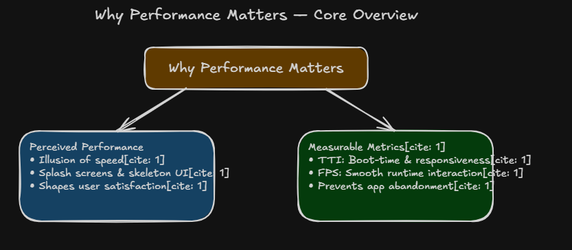
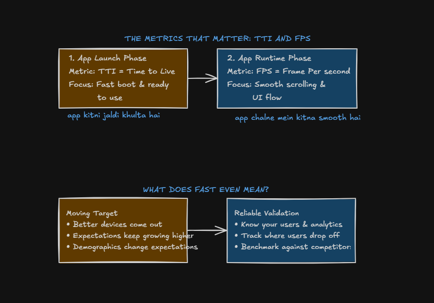
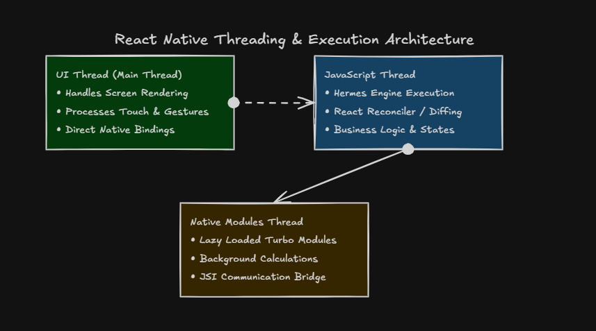
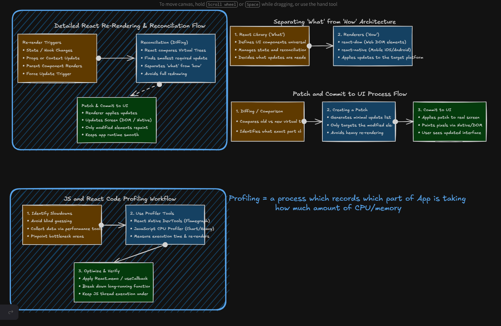

# 📖 Module 8 — Deep Dive Notes

### React Native: Perceived Speed, Optimistic Updates & Prefetch


> **Question:** Perceived speed: optimistic updates, prefetch, never show a blank screen.
>
> Module 7 taught the **four screen states** (loading, empty, error, loaded). This chapter teaches you how to **transition between those states** so users almost never feel like they're waiting — even when the network is slow.

---


## 1 · ⚡ Why Performance Matters

Real speed and **felt** speed are not the same thing. Production apps like Instagram, WhatsApp, Swiggy, Uber, YouTube, and X optimize both.




| Category                  | What it measures               | Examples                                          |
| ------------------------- | ------------------------------ | ------------------------------------------------- |
| **Perceived performance** | How fast the app *feels*       | Skeleton UI, splash screens, instant cart updates |
| **Measurable metrics**    | How fast the app *actually is* | TTI (boot time), FPS (scroll smoothness)          |


```
Two sides of the same coin

Perceived                    Measurable
(feel fast)                  (be fast)
     │                            │
     ▼                            ▼
Skeleton, prefetch,          TTI, FPS, profiling,
optimistic updates           thread architecture
     │                            │
     └──────────┬─────────────────┘
                ▼
        User stays on the app
        instead of uninstalling
```

> **Key insight:** Users don't wait for your API — they wait for what they **see**. Perceived speed tricks the brain into thinking the app is already done.

---


## 2 · 📊 TTI, FPS & What "Fast" Means

Performance has two distinct phases — launch and runtime.




| Phase           | Metric                        | What it means                             | Hindi shorthand                    |
| --------------- | ----------------------------- | ----------------------------------------- | ---------------------------------- |
| **App launch**  | **TTI** (Time to Interactive) | How fast the app boots and becomes usable | *App kitni jaldi khulta hai*       |
| **App runtime** | **FPS** (Frames Per Second)   | How smooth scrolling and animations feel  | *App chalne mein kitna smooth hai* |


**Target:** 60 FPS = 16.6 ms per frame. Drop below that and users feel jank.


| FPS   | User experience              |
| ----- | ---------------------------- |
| 60    | Smooth — butter              |
| 30–45 | Noticeable stutter on scroll |
| < 30  | Laggy, feels broken          |


**"Fast" is a moving target:**


| Factor                         | Effect                                       |
| ------------------------------ | -------------------------------------------- |
| Better devices ship every year | Yesterday's "fast" is today's baseline       |
| User expectations keep rising  | Swiggy sets the bar for your food app        |
| Demographics differ            | Budget Android phones need more optimization |


**How to validate you're actually fast:**

- Know your users — analytics show where they drop off
- Track slow screens — which screen loses users?
- Benchmark against competitors — if Swiggy loads in 1s, 3s feels broken

---


## 3 · 🚫 Never Show a Blank Screen

The single biggest perceived-speed win: **always show something immediately**.


| ``` Bad ```                       | Good                                     |
| --------------------------------- | ---------------------------------------- |
| White screen for 2 seconds        | Skeleton cards appear instantly          |
| Spinner on empty white background | Branded splash → skeleton → content      |
| Nothing until API returns         | Cached data shown while fresh data loads |


```
Blank Screen Timeline (bad)

0ms ──────── 2000ms ──────── 2100ms
     WHITE         API arrives
     NOTHING       Content pops in (jarring)

Skeleton Timeline (good)

0ms ──────── 200ms ────────── 2000ms
     SKELETON    Shimmer       Real cards
     SHAPES      animating     fade in smoothly
```

**Rules:**


| Rule                                       | Why                                     |
| ------------------------------------------ | --------------------------------------- |
| Show skeleton **before** API call finishes | User sees progress immediately          |
| Match skeleton shape to real content       | No layout jump when data arrives        |
| Use cached/stale data while refreshing     | User sees last-known content, not blank |
| Never block the UI thread during load      | JS thread busy = frozen screen          |


> Module 7 covered *what* states to show. Module 8 covers *how fast* to show them.

---


## 4 · 🦴 Skeleton, Prefetch & Stale-While-Revalidate

Three techniques that eliminate the "waiting" feeling:

### Skeleton UI

Placeholder UI that mimics the final layout. Foodie's `FruitExplorerScreen` renders 6 `SkeletonCard` components with shimmer animation while fruits load.

```jsx
if (loading) {
  return (
    <SafeAreaView>
      {Array.from({ length: 6 }).map((_, i) => (
        <SkeletonCard key={i} />
      ))}
    </SafeAreaView>
  );
}
```


### Prefetch

Load data **before** the user needs it.


| Prefetch trigger             | Example                                                    |
| ---------------------------- | ---------------------------------------------------------- |
| User hovers / presses a card | Start fetching restaurant menu before navigation completes |
| App launch                   | Preload home screen data in splash phase                   |
| Scroll near end              | `onEndReached` loads next page before user hits bottom     |
| Tab switch                   | Fetch cart data when user taps Cart tab                    |


```
Without Prefetch                    With Prefetch

User taps Restaurant                User presses Restaurant card
        │                                   │
        ▼                                   ▼
Navigate to screen                  Start fetch (parallel)
        │                                   │
        ▼                                   ▼
Start API call                      Navigate to screen
        │                                   │
        ▼                                   ▼
Wait 2 seconds...                   Data already cached → instant render
        │                                   │
        ▼                                   ▼
Show content                        Show content (feels instant)
```


### Stale-While-Revalidate

Show **cached/old data immediately**, fetch fresh data in background, swap when ready.

```jsx
// Pattern: show cached restaurants instantly, refresh silently
useEffect(() => {
  const cached = getCachedRestaurants();
  if (cached) {
    setRestaurants(cached);
    setLoading(false);       // user sees content NOW
  }
  fetchFreshRestaurants();   // update in background
}, []);
```

Foodie's cart hydration follows this pattern — `CartContext` restores from AsyncStorage on mount so the cart tab never shows empty while loading.

---


## 5 · 🚀 Optimistic Updates

**Optimistic update** = update the UI **immediately**, before the server confirms. If the server fails, roll back.

```
Optimistic Flow

User taps "Add to Cart"
        │
        ▼
Update UI instantly  ← user sees item in cart NOW
        │
        ▼
Send API request in background
        │
   ┌────┴────┐
   │         │
   ▼         ▼
Success    Failure
(keep UI)  (rollback + show error toast)
```


| Action         | Without optimistic       | With optimistic            |
| -------------- | ------------------------ | -------------------------- |
| Like a post    | Wait 500ms → heart fills | Heart fills instantly      |
| Add to cart    | Wait → item appears      | Item appears on tap        |
| Delete message | Wait → message vanishes  | Message vanishes instantly |


**Foodie — cart is already optimistic:**

```jsx
// CartContext.js — UI updates before any server call
const addItem = item => {
  setCartItems(previousCart => [
    ...previousCart,
    { ...item, quantity: 1 },
  ]);
  showCartNotification(item.name);
};
```

The cart updates on tap. AsyncStorage persistence happens in a separate effect — the user never waits.

**Production pattern with rollback:**

```jsx
const addItemOptimistic = async (item) => {
  const previous = cartItems;

  // 1. Update UI immediately
  setCartItems(prev => [...prev, { ...item, quantity: 1 }]);

  try {
    // 2. Confirm with server
    await api.addToCart(item.id);
  } catch (err) {
    // 3. Rollback on failure
    setCartItems(previous);
    showToast('Could not add item. Try again.');
  }
};
```


| Use optimistic when                   | Don't use optimistic when              |
| ------------------------------------- | -------------------------------------- |
| Action is reversible (like, cart add) | Payment, irreversible delete           |
| Failure is rare                       | Server is source of truth for money    |
| Instant feedback matters most         | Legal/compliance requires confirmation |


---


## 6 · 🧵 React Native Threading Architecture

Why perceived speed breaks when the JS thread gets busy.




| Thread                    | Responsibility                                         | If blocked                        |
| ------------------------- | ------------------------------------------------------ | --------------------------------- |
| **UI Thread** (Main)      | Screen rendering, touch, gestures, native bindings     | Frozen screen, no touch response  |
| **JavaScript Thread**     | Hermes engine, React reconciler, business logic, state | Animations stutter, scroll janks  |
| **Native Modules Thread** | Turbo Modules, background calculations, JSI bridge     | Slow API calls, heavy native work |


```
User scrolls a list

UI Thread          JS Thread              Native Modules
    │                  │                        │
    │  touch event     │                        │
    │ ───────────────► │                        │
    │                  │  process scroll logic  │
    │                  │  re-render list items  │
    │  ◄────────────── │  send layout updates   │
    │  paint frames    │                        │
    │                  │                        │
    │  If JS is busy   │                        │
    │  for > 16ms      │                        │
    │  ──────────────► │  FRAME DROPPED 🔴      │
    │  jank / stutter  │                        │
```

**Rules to keep 60 FPS:**


| Do                                          | Don't                                       |
| ------------------------------------------- | ------------------------------------------- |
| `useNativeDriver: true` for animations      | Animate layout properties on JS thread      |
| `useMemo` / `React.memo` to skip re-renders | Filter/sort large lists on every render     |
| Debounce search input (`useDebounce`)       | Call API on every keystroke                 |
| Offload heavy work to native modules        | Parse large JSON synchronously on JS thread |


Foodie examples:

- `SkeletonCard` uses `useNativeDriver: true` for shimmer — runs on UI thread
- `HomeScreen` uses `useDebounce(searchText, 300)` — avoids filtering on every keystroke
- `useMemo` for `filteredRestaurants` — recalculates only when search or data changes

---


## 7 · 🔄 Reconciliation, Re-renders & Profiling

Every state update triggers React's reconciliation pipeline. Understanding it helps you optimize perceived speed.



### Re-render pipeline

```
Step 1: Re-render Triggers          Step 2: Reconciliation           Step 3: Patch & Commit
─────────────────────────          ────────────────────────          ──────────────────────
State / hook changes        →      Compare virtual trees       →     Apply minimal update
Props or context update            Find smallest diff needed          to native screen
Parent component renders           Avoid full redraw                  Only changed pixels repaint
```


### React separates "what" from "how"


| Layer              | Role                                                    | In React Native                    |
| ------------------ | ------------------------------------------------------- | ---------------------------------- |
| **React (what)**   | Defines components, manages state, decides what changed | Your JSX + hooks                   |
| **Renderer (how)** | Applies updates to the target platform                  | `react-native` → iOS/Android views |


### Profiling workflow

> **Profiling** = recording which parts of the app consume CPU and memory.

```
Step 1: Identify Slowdowns     Step 2: Use Profiler Tools      Step 3: Optimize & Verify
─────────────────────────     ──────────────────────────      ─────────────────────────
Don't guess                   React Native DevTools           React.memo / useCallback
Collect data                  Flamegraph view                 Break up long functions
Pinpoint bottlenecks          JS CPU Profiler                 Keep JS thread < 16ms/frame
```


| Tool                        | What it shows                         |
| --------------------------- | ------------------------------------- |
| **React DevTools Profiler** | Which components re-rendered and why  |
| **Flipper / RN DevTools**   | Network, layout, performance timeline |
| **JS CPU Profiler**         | Which functions eat the most time     |


**Common fixes after profiling:**

```jsx
// Before — re-renders on every parent render
function RestaurantCard({ restaurant }) { ... }

// After — skip re-render if props unchanged
const RestaurantCard = React.memo(function RestaurantCard({ restaurant }) { ... });

// Before — new function every render → child re-renders
<SearchBar onChange={text => setSearchText(text)} />

// After — stable reference
const handleSearch = useCallback(text => setSearchText(text), []);
<SearchBar onChange={handleSearch} />
```

---


## 8 · 📋 Perceived Speed Playbook

Combine everything into a checklist for every screen:


| Technique                  | When                                  | Foodie example                                      |
| -------------------------- | ------------------------------------- | --------------------------------------------------- |
| **Skeleton**               | Initial load                          | `FruitExplorerScreen` → 6 shimmer cards             |
| **Never blank**            | Always                                | Show skeleton or cached data — never white screen   |
| **Prefetch**               | Before navigation                     | Fetch menu when user presses restaurant card        |
| **Stale-while-revalidate** | Return visits                         | Cart restored from AsyncStorage on launch           |
| **Optimistic update**      | User actions                          | Cart `addItem` updates UI on tap                    |
| **Debounce**               | Search/filter                         | `useDebounce(searchText, 300)` on HomeScreen        |
| **useMemo**                | Expensive compute                     | `filteredRestaurants` only recalculates when needed |
| **useNativeDriver**        | Animations                            | Skeleton shimmer, HomeScreen fade-in                |
| **Pull-to-refresh**        | Re-fetch without leaving loaded state | HomeScreen `RefreshControl`                         |


```
Perceived Speed Stack

         User opens screen
                │
                ▼
    ┌── Show cached / skeleton ──┐     ← never blank
    │                             │
    ▼                             ▼
 Prefetch next screen        Optimistic actions
 (parallel fetch)             (instant UI feedback)
    │                             │
    ▼                             ▼
 Keep JS thread free          60 FPS maintained
 (memo, debounce, native       (smooth scroll +
  driver animations)            no jank)
    │                             │
    └──────────┬──────────────────┘
               ▼
      App feels instant ✅
```

---


## 9 · 🍔 Foodie App — Real Examples


| Screen / Feature        | Perceived speed technique                     | What user feels                           |
| ----------------------- | --------------------------------------------- | ----------------------------------------- |
| **FruitExplorerScreen** | Skeleton cards with shimmer                   | Content is "almost ready"                 |
| **HomeScreen**          | `useDebounce` + `useMemo`                     | Search feels instant, no lag              |
| **HomeScreen**          | `RefreshControl`                              | Pull to refresh without leaving the list  |
| **HomeScreen**          | Fade-in animation (`useNativeDriver`)         | Smooth entrance, not a hard pop-in        |
| **CartContext**         | Optimistic `addItem` + AsyncStorage hydration | Cart updates on tap, survives app restart |
| **AddressContext**      | Hydration from storage                        | Addresses appear without re-fetching      |


**What to add next for production polish:**


| Gap                                         | Fix                                                         |
| ------------------------------------------- | ----------------------------------------------------------- |
| HomeScreen shows text loading, not skeleton | Replace with `SkeletonCard`-style placeholders              |
| No prefetch on restaurant tap               | Start menu fetch in `onPressIn` before navigation           |
| No rollback on cart API failure             | Wrap `addItem` in try/catch with rollback (when API exists) |


---


## 10 · 💼 Interview Questions


| Question                        | Answer                                                                            |
| ------------------------------- | --------------------------------------------------------------------------------- |
| Perceived vs real performance?  | Perceived = how fast it *feels* (skeleton, optimistic). Real = measurable TTI/FPS |
| What is TTI?                    | Time to Interactive — how long until the app is usable after launch               |
| What is a good FPS target?      | 60 FPS (16.6 ms per frame)                                                        |
| What is an optimistic update?   | Update UI immediately, confirm with server later, rollback on failure             |
| What is prefetch?               | Load data before the user navigates to the screen that needs it                   |
| Why never show a blank screen?  | Users interpret white screens as broken — skeleton/cached data feels instant      |
| What blocks the JS thread?      | Heavy computation, large re-renders, synchronous JSON parsing                     |
| Why `useNativeDriver: true`?    | Runs animation on UI thread — JS thread free for logic                            |
| What is profiling?              | Measuring which code paths consume the most CPU/memory at runtime                 |
| What is stale-while-revalidate? | Show cached data instantly, fetch fresh data in background                        |


---


📋 **Need a quick refresher?**

**[← Back to Summary — read.md](read.md)**

*React Native Foundation · Module 8*

